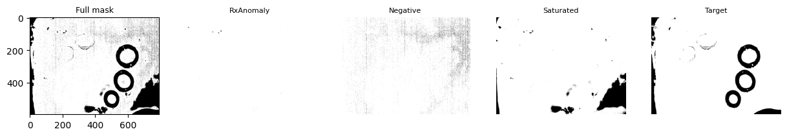
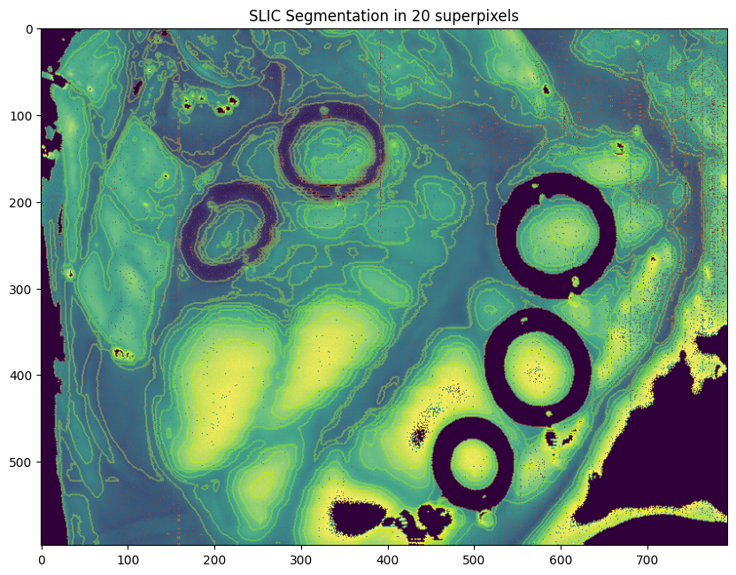
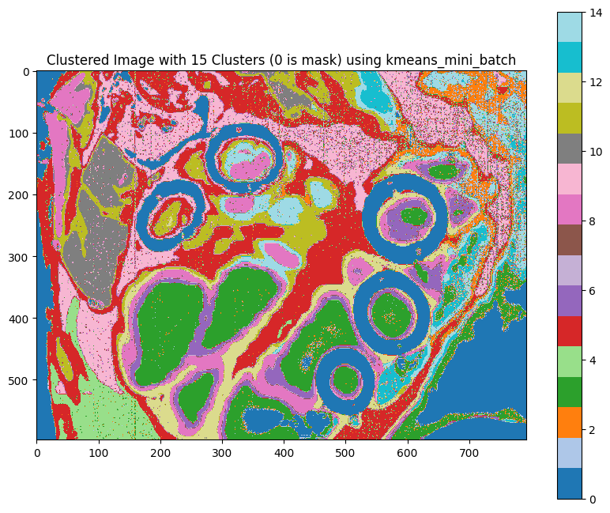
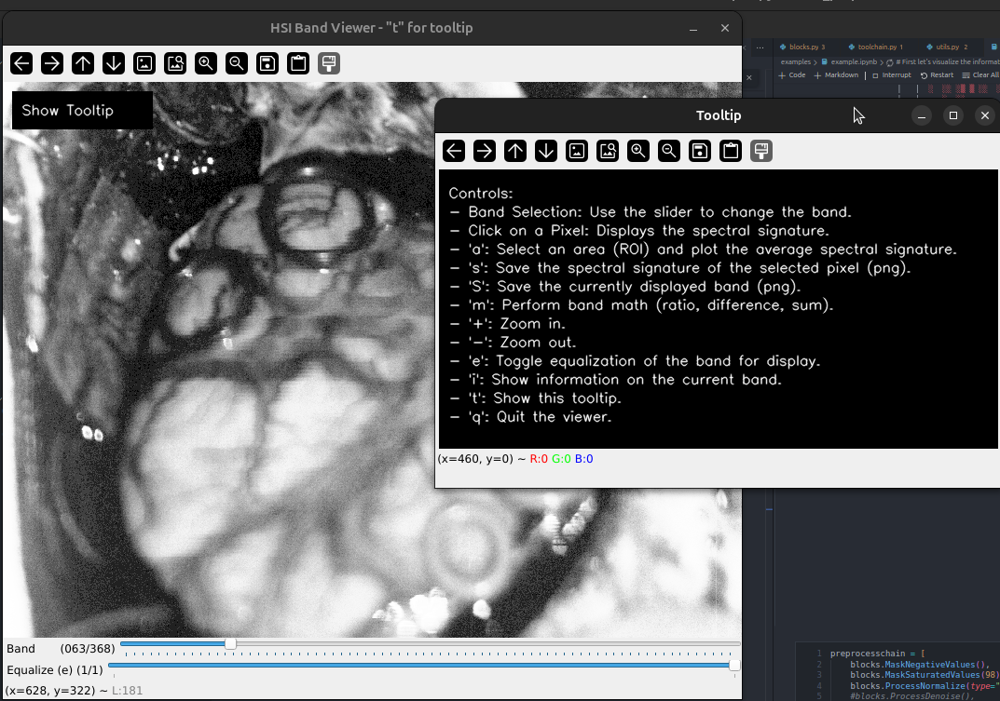

# HyPyFlow - Hyperspectral preprocessing tools for Python

This is just a collection of tools that i use too often to not have them in a single place. The main goal is to have a set of tools that can be used to preprocess hyperspectral data in Python. The tools are not meant to be the most efficient or the most optimized, but they are meant to be easy to use and to be able to be used in a pipeline.

Available operations are splitted into two main categories:
* **Maskers**: This types of operations are meant to be used to generate masks that match the given criteria. These masks are:
  * Mask Negative Values -> This mask will be used to mask all the negative values in the data.
  * Mask Zero Values -> This mask will be used to mask all the zero values in the data.
  * Mask Saturated Values -> This mask will be used to mask all the saturated values in the data. It uses a threshold with percentile to determine the saturation.
  * Mask Rx Anomaly Detection -> This mask will be used to mask all the values that are considered anomalies using the Rx Anomaly Detection algorithm. This algorithm is based on the Mahalanobis distance between the background and each of the pixels.
  * Mask Target Signature -> This is a handy but manual one. You have to select a method (which can be either Spectral Angle Mapper (recommended) or Spectral Correlation Index) and a threshold. Esentially two ways to use it:
    * Provide an spectral signature that you want to mask from the data. This will be used to mask all the pixels that are similar to the provided signature.
    * Use the `interactive` mode. This will open two windows, one with a slider and a representation of the data and the other one with the resulting mask. You then select either a pixel or an area (based on the `select_area` parameter) and move the slider until you get the desired mask. This is useful to get the threshold for the method you selected. When finished, just press `q` to close the windows and get the mask.
* **Processors**: This type of blocks are used **after** the masking process to alter the data. Available options are:
  * Normalize -> This processor will normalize the data using the selected method. Available methods are:
    * Min-Max -> This method will normalize the data using the Min-Max normalization method.
    * Mean-Std -> This method will normalize the data using the Mean-Std normalization method.
    * SNV -> This method will normalize the data using the Standard Normal Variate method.
    * Helicoid -> This method will normalize the data using the Helicoid method.
  * Denoise -> This processor will denoise the data using the Hy-Sime algorithm.
  * ReduceDimensionality -> Uses eithe PCA(recommended) or NMF(too slow...) to select the best bands for the data. This is useful to reduce the dimensionality of the data. If the `transform` parameter is set to `True`, the data will be transformed to the new space. If not, the data will be reduced to the selected number of components.
  * SmoothSpectral and SmoothSpatial. To apply a smoothing filter to the spectral or spatial dimensions of the data. Check each block documentation for more details on the available filters.
  * Derivate. To apply derivations of arbitrary order on the cube data.
  * Interpolate. To interpolate the spectral bands of the data and generate new bands.
  * AddNoise. To add noise to the data. The user selects the noise level and applies gaussian noise to the data in the spectral dimension.

> IMPORTANT: The order of execution is the following:
> 1. Maskers, in the order they are added.
> 2. Processors, in the order they are added. They only work on the masked data.


### Clusterers

There are a set of clustering methods that are available to use. These are splitted from the main pipeline as they are not meant to be used in the preprocessing pipeline. These method will reduce the information by clustering on the spatial and spectral features. The available methods are:
* **KMeans** -> This is the KMeans clustering algorithm. It uses the `sklearn` implementation.
* **KMedioids** -> This is the KMedioids clustering algorithm. It uses the `kmedoids` package optimized implementation.
* **SLIC** -> This is the SLIC superpixel clustering algorithm. It uses the `skimage` implementation.

This methods are provided in the SpatialSpectralCluster class.

### Spectral distance measures

There is a subset of functions that can be imported with `from hypyflow import distance_metrics` that will compute the distance from a reference signature to the rest of the signatures in the data. The available metrics are:
* **SAM** -> Spectral Angle Mapper
* **SID** -> Spectral Information Divergence
* **SID_TAN_SAM** -> Computes SAM and SID and combines with a tangent function.
* **SID_SIN_SAM** -> Computes SAM and SID and combines with a sin function.
* **JM_BC** -> Jeffries-Matusita distance (JM) using the Bhattacharyya Coefficient (BC)

### Usage

Check the `examples` folder.

Main idea with the pipeline is:
```python
from hypyflow import blocks, PreprocessingPipeline
preprocesschain = [
    blocks.MaskNegativeValues(),
    blocks.ProcessNormalize(type="minmax"),
    blocks.ProcessReduceDimensionality(method="PCA", explained_variance_threshold=98),
    # include all the blocks you want to use
]
pipeline = PreprocessingPipeline(preprocesschain)
processed_data, full_mask, individual_masks = pipeline(preprocesschain, verbose=True, plot_masks=True)
``` 

On the other hand, to use the clustering methods:
```python
from hypyflow import SpatialSpectralCluster

reductor = SpatialSpectralCluster(slic_n_segments=100, slic_compactness=0.1, k_n_clusters=40, k_method="kmedoids", kmed_metric=SAM_metric)
final_data,slic_cluster_img,  kmed_cluster_img=processer.run(cube, mask=full_mask, plot=True)
reconstructed= processer.reconstruct(final_data)
```

### Example Results

Results of applying the pipeline to a hyperspectral image:

```
--------------Original data--------------
 - Data shape: (597, 793, 369)
 - Data type: float64
 - Data range: -0.14659685863874344 - 3.61172373766686
 - Data mean: 0.26104514713165017 - Data std: 0.19599373925771513
--------------Running Pipeline--------------
 - Running pipeline block: RxAnomaly
 - Running pipeline block: Negative
 - Running pipeline block: Saturated
 - Running pipeline block: Target
Selected area from (455, 480) to (466, 495)
Shape of selected area: (15, 11, 369)
 - Running pipeline block: Normalize
   + Input Data shape: (597, 793, 369)
   + Output Data shape: (597, 793, 369)
--------------Final data--------------
 - Data shape: (597, 793, 369)
 - Data type: float64
 - Data range: 0.0 - 1.0
 - Data mean: 0.2579696591514508 - Data std: 0.23012076506442325
 - Masked pixels 80044 of 473421
--------------Pipeline finished--------------
```



And some results of the clustering methods:



And the visualization window:



## Install 

just run:

```bash
pip3 install git+https://gitlab.citsem.upm.es/hyperspectral/hyperspectralpreprocessor.git
```

## TODOs:
- [X] Add clustering methods 
    - [X] Add SLIC based superpixel cluster
    - [X] Add KMeans based cluster
    - [X] Add KMedioids based cluster
- [ ] Add more denoising methods
- [ ] Add smoothing methods (Gaussian, Median, etc)
- [X] Add some visualization options
- [ ] Add data augmentation methods
